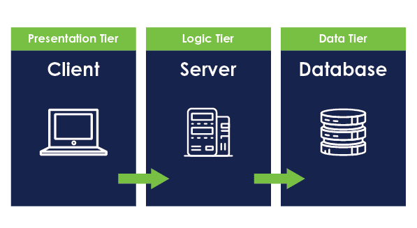

# Docker-K8s-project-on-ECS

This repository contains the source code and deployment configuration for a 3-tier application built using Docker and orchestrated with Kubernetes, deployed on Amazon ECS (Elastic Container Service).

This repo will focus on the deployment of the application not the code itself.
## Table of Contents

- [Overview](#overview)
- [Prerequisites](#prerequisites)
- [Getting Started](#getting-started)
- [Project Structure](#project-structure)
- [Deployment](#deployment)
- [Monitoring](#monitoring)
- [Contributing](#contributing)
- [License](#license)

## Overview

This 3-tier application is composed of three main components:

1. **Frontend**: The user interface layer built with [Node.js](https://nodejs.org/).
2. **Backend**: The application logic layer implemented using [Node.js](https://nodejs.org/).
3. **Database**: The data storage layer powered by [MongoDB](https://www.mongodb.com/).

The application is containerized using Docker, and the orchestration is managed with Kubernetes, specifically deployed on Amazon ECS for scalability and flexibility.
## Prerequisites

Before getting started, ensure you have the following tools installed:

- [Docker](https://www.docker.com/)
- [kubectl](https://kubernetes.io/docs/tasks/tools/install-kubectl/)
- [AWS CLI](https://aws.amazon.com/cli/)
- [eksctl](https://eksctl.io/)

## Project Structure

**frontend/:** Contains the frontend application code and Dockerfile.

**backend/:** Contains the backend application code , the MongoDB database configuration and Dockerfile.

**k8s/:** Kubernetes deployment files for each tier.

## Contributing

Pull requests are welcome. For major changes, please open an issue first
to discuss what you would like to change.

Please make sure to update tests as appropriate.

## License

[MIT](https://choosealicense.com/licenses/mit/)